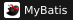
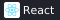
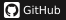

<!-- Header -->

  

  
  
  

  <strong>서비스를 만들고, 운영하며, 개선하는 백엔드 개발자 이의선입니다.</strong>

  Java와 Spring을 기반으로 웹 서비스를 개발합니다. 
  솔루션 개발·유지보수부터 고객사 프로젝트와 서비스 운영까지 경험해 왔습니다.

 

## 👩‍💻 About Me

- **Backend** — Java · Spring 기반 웹 서비스 개발
- **Experience** — 보안 솔루션 개발·유지보수 및 고객사 프로젝트 수행
- **Operations** — 서비스 운영 지원과 솔루션 릴리즈 경험

 

## 🛠️ Tech Stack

주로 사용하는 백엔드 및 데이터베이스 기술입니다.

<table>
  <tr><th width="170" align="left">Category</th><th width="580" align="left">Technologies</th></tr>
  <tr><td><strong>Backend</strong></td><td>
    
    
    
    
  </td></tr>
  <tr><td><strong>Database</strong></td><td>
    
    
    
  </td></tr>
</table>

### Also Experienced

프로젝트 개발 및 운영 과정에서 사용한 기술과 도구입니다.

<table>
  <tr><th width="170" align="left">Category</th><th width="580" align="left">Technologies</th></tr>
  <tr><td><strong>Frontend</strong></td><td>
    
    
    
    
  </td></tr>
  <tr><td><strong>AI-assisted</strong></td><td>
    
    
  </td></tr>
  <tr><td><strong>Version Control</strong></td><td>
    
    
    
  </td></tr>
  <tr><td><strong>Collaboration</strong></td><td>
    
    
  </td></tr>
  <tr><td><strong>Environment</strong></td><td>
    
    
  </td></tr>
</table>

React와 Node.js는 고객사 프로젝트에서 AI 도구의 도움을 받아 사용했습니다.

 

## 💼 Experience

### SotaTek Korea
`2025.10 – 2026.09` 고객사 프로젝트 개발 및 서비스 운영 지원

### NileSOFT
`2022.08 – 2025.07` 보안 솔루션 유지보수 및 개발, 릴리즈 담당

 

## 📊 Activity

  
  

  
🏆 GitHub Trophies

   
  

    
  

<!-- Footer -->

  

